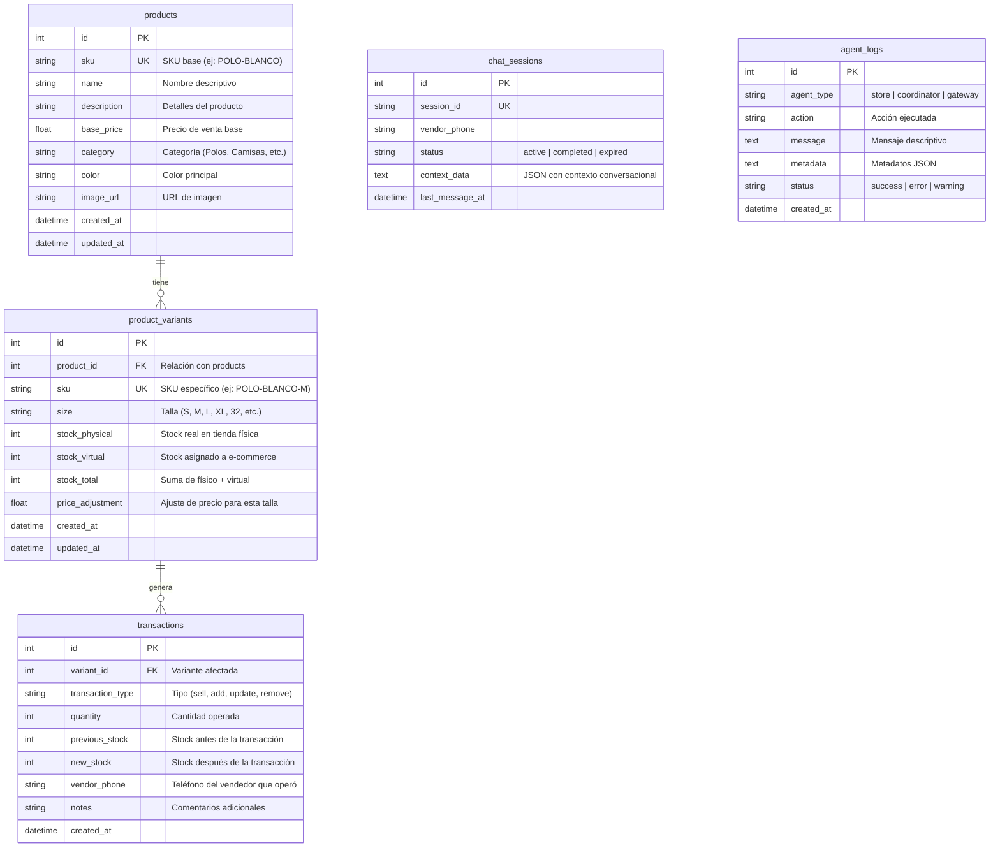

# 🏗️ Arquitectura y Componentes del Sistema MAS-CIS

Este documento describe detalladamente la arquitectura del sistema, explicando cómo está estructurado el **Frontend**, **Backend**, **Base de Datos** y la interacción de los **Agentes Autónomos**.

---

## 💻 1. Arquitectura del Frontend

El frontend está estructurado como una Single Page Application (SPA) minimalista y ligera que no requiere frameworks pesados (como React o Angular), sino que utiliza **HTML5 semántico**, **CSS3 vanilla**, y **JavaScript (ES6+) nativo** para mayor velocidad y menor latencia de carga.

### Archivos Clave
- [index.html](file:///c:/Prototipo%20Tesis%201/frontend/index.html): Dashboard del Administrador. Muestra el estado de salud del sistema, estadísticas rápidas de inventario, el estado activo de los agentes en tiempo real y la tabla de inventario completo.
- [store.html](file:///c:/Prototipo%20Tesis%201/frontend/store.html): Vista de catálogo para el cliente/tienda. Permite filtrar productos por categoría (Polos, Pantalones, Camisas, Accesorios) y buscar por nombre o SKU.
- [product-detail.html](file:///c:/Prototipo%20Tesis%201/frontend/product-detail.html): Detalle del producto donde se pueden visualizar las variantes por talla, precios y stock físico/virtual disponible.
- [app.js](file:///c:/Prototipo%20Tesis%201/frontend/js/app.js): Lógica principal del Dashboard. Se encarga de hacer encuestas periódicas (polling) cada 5 segundos al backend para obtener actualizaciones de stock y estado de los agentes de forma fluida.

### Estilo e Interfaz (CSS)
Se utiliza diseño modular CSS encapsulado en:
- `styles.css`: Estilos del dashboard (tarjetas de estadísticas, rejilla de agentes, registro de actividad).
- `store.css` y `product-detail.css`: Diseños limpios, responsivos y con tipografía moderna (Google Font *Inter*), optimizados para dispositivos móviles.

---

## ⚙️ 2. Arquitectura del Backend (API REST)

El backend está desarrollado sobre **FastAPI** (Python), elegido por su alto rendimiento, validación automática de tipos con Pydantic y generación automática de OpenAPI (`/docs`).

### Módulos Principales
- **Punto de Entrada (`main.py`)**: Inicializa el logger y corre el servidor Uvicorn en el puerto 8000.
- **Rutas y Controladores (`src/api/main.py`)**:
  - **E-commerce & Dashboard**: Endpoints para listar productos con variantes (`/api/products`), obtener estadísticas agregadas (`/api/dashboard/stats`), estado de agentes (`/api/dashboard/agents`), y el historial de movimientos (`/api/transactions`).
  - **Manejo de Stock**: El endpoint `PUT /api/products/{sku}/stock` recibe actualizaciones y las delega al **Agente Coordinador** para su procesamiento.
  - **Webhook de WhatsApp**: Recibe solicitudes POST en `/webhooks/whatsapp` y las encamina a través de la pasarela de Meta.
- **Configuración (`src/config/settings.py`)**: Centraliza la lectura de variables de entorno mediante `pydantic-settings`, construyendo dinámicamente la URL de la base de datos según el motor configurado.

---

## 🗄️ 3. Estructura de la Base de Datos

El sistema implementa un modelo relacional de persistencia usando **SQLAlchemy ORM**. Aunque por defecto utiliza **SQLite** para desarrollo local, está diseñado con compatibilidad completa para **Microsoft SQL Server** en producción mediante el driver PyODBC.

### Diagrama de Relación y Tablas

### Características del Diseño de Datos
1. **Desacoplamiento por Variantes (Tallas)**: Los productos se dividen en un modelo padre (`products`) y un modelo variante (`product_variants`). Esto previene la duplicación de información general (imágenes, categorías, precios base) permitiendo el control individual de stock por talla.
2. **Historial Inmutable (`transactions`)**: Cada movimiento de stock (venta, adición, merma) inserta una nueva fila que documenta el stock de entrada y salida, asegurando trazabilidad y auditoría completa.
3. **Manejo de Transacciones Hilo-Seguro**: Mediante un context manager (`get_db`), la aplicación garantiza la apertura de sesiones de corta duración que hacen auto-rollback en caso de excepciones para evitar bloqueos y corrupción de datos.

---

## 🤖 4. Capa de Agentes Multiagentes (MAS)

El núcleo del negocio reside en un sistema multiagente cooperativo. Los agentes heredan de una clase base común ([base_agent.py](file:///c:/Prototipo%20Tesis%201/src/agents/base_agent.py)) que les proporciona manejo de estado interno (`idle`, `processing`, `waiting`, `error`) y registro de actividad estandarizado.

### 🏭 Agente de Tienda (Store Agent)
- **Función**: Interactuar bidireccionalmente con el usuario (vendedor).
- **Flujo**:
  - Recibe el texto sin estructurar del canal de comunicación (WhatsApp).
  - Invoca al procesador NLU para extraer el comando.
  - Consulta al repositorio si existe el producto y su variante.
  - Ejecuta la operación de stock y responde al vendedor con plantillas claras en formato Markdown compatible con WhatsApp.

### 🔄 Agente Coordinador (Coordinator Agent)
- **Función**: Servir como orquestador centralizador del inventario.
- **Flujo**:
  - Recibe peticiones estructuradas de actualización de stock (provenientes de la API o de integraciones de e-commerce).
  - Valida las reglas de negocio (ej. impedir que se vendan productos sin stock físico suficiente).
  - Ejecuta transacciones atómicas y genera eventos de sincronización (los cuales pueden integrarse con plataformas e-commerce como WooCommerce o Shopify).

### 🧠 Procesador NLU (Natural Language Understanding)
Para procesar las intenciones de texto, el sistema utiliza un motor de procesamiento de lenguaje natural local:
- **Motor NLP Local (spaCy + Regex)**: Emplea la librería `spaCy` (modelo `es_core_news_sm`) y patrones de Expresiones Regulares (Regex) para procesar el texto y extraer información (intención, cantidad, producto, talla y color) de forma eficiente y sin incurrir en costos de API de terceros. Este motor garantiza que el procesamiento ocurra "on-premise".
