# 🏗️ Arquitectura del Sistema MAS-CIS

## Documentación Técnica Detallada

---

## 📋 Tabla de Contenidos

1. [Visión General](#visión-general)
2. [Arquitectura de Alto Nivel](#arquitectura-de-alto-nivel)
3. [Componentes del Sistema](#componentes-del-sistema)
4. [Flujo de Datos](#flujo-de-datos)
5. [Patrones de Diseño](#patrones-de-diseño)
6. [Diagramas Técnicos](#diagramas-técnicos)

---

## 🎯 Visión General

El **Sistema MAS-CIS** implementa una arquitectura de **Sistemas Multiagentes (MAS)** para resolver el problema de sincronización de inventario en tiempo real entre ventas físicas y comercio electrónico.

### Principios Arquitectónicos

1. **Separación de Responsabilidades**: Cada agente tiene un propósito específico
2. **Autonomía**: Los agentes toman decisiones independientes
3. **Comunicación Asíncrona**: Mensajes entre componentes
4. **Escalabilidad**: Diseño modular y extensible
5. **Tolerancia a Fallos**: Manejo robusto de errores

---

## 🏛️ Arquitectura de Alto Nivel

### Diagrama de Arquitectura General

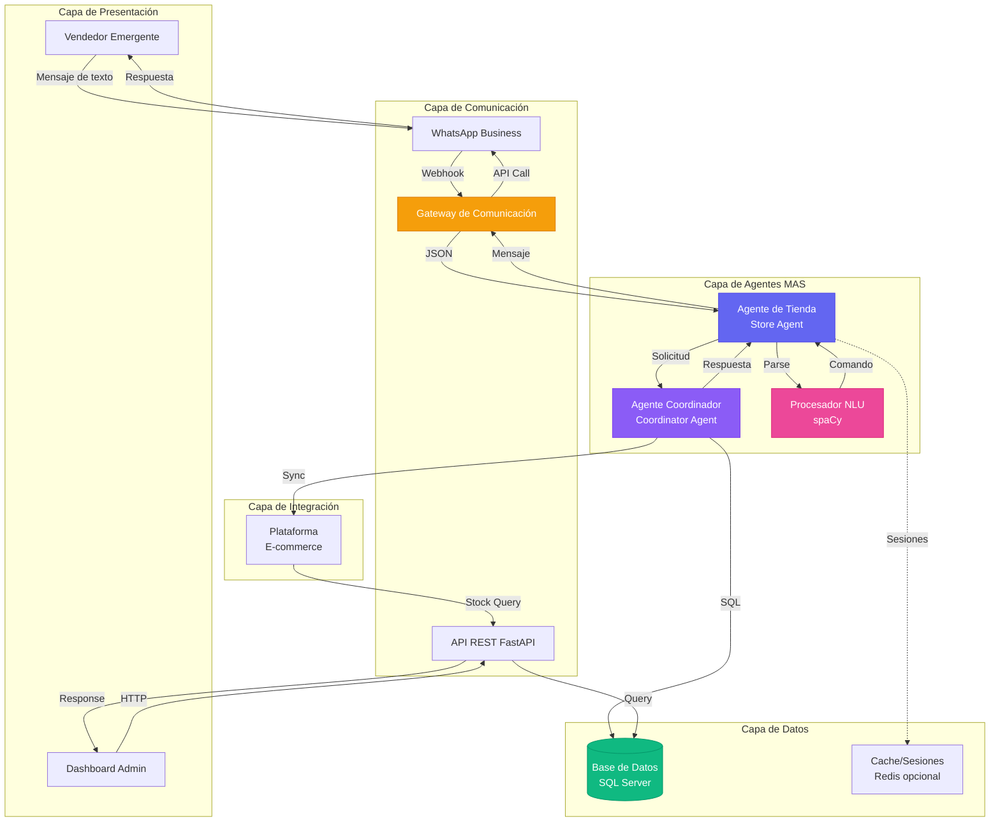

### Capas del Sistema

| Capa | Responsabilidad | Tecnologías |
|------|----------------|-------------|
| **Presentación** | Interfaz con usuarios | WhatsApp, HTML/CSS/JS |
| **Comunicación** | Gateway y API | FastAPI, WhatsApp API |
| **Agentes** | Lógica de negocio | Python, spaCy |
| **Datos** | Persistencia | SQL Server, SQLAlchemy |
| **Integración** | Conexión externa | REST API |

---

## 🤖 Componentes del Sistema

### 1. Agente de Tienda (Store Agent)

**Propósito:** Interfaz inteligente entre el vendedor y el sistema.

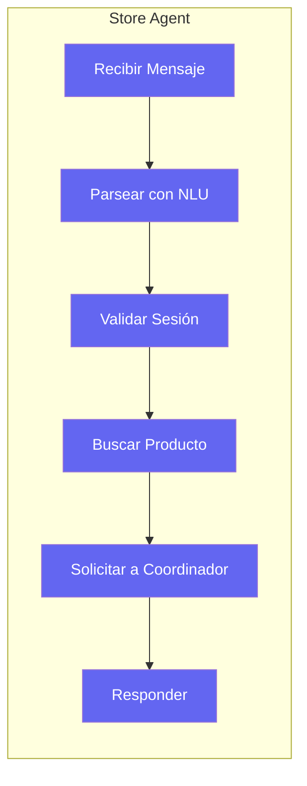

**Características:**
- ✅ Procesamiento de lenguaje natural
- ✅ Gestión de contexto conversacional
- ✅ Validación de comandos
- ✅ Búsqueda inteligente de productos

**Código:** [store_agent.py](file:///c:/Prototipo%20Tesis%201/src/agents/store_agent.py)

---

### 2. Agente Coordinador (Coordinator Agent)

**Propósito:** Orquestar operaciones de inventario y garantizar consistencia.

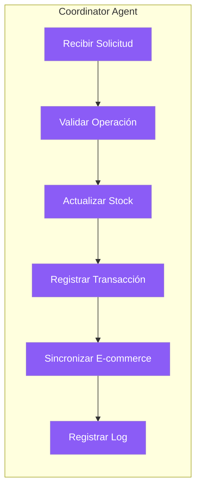

**Responsabilidades:**
- ✅ Validación de reglas de negocio
- ✅ Actualización atómica de stock
- ✅ Registro de transacciones
- ✅ Sincronización con e-commerce
- ✅ Detección de conflictos

**Código:** [coordinator_agent.py](file:///c:/Prototipo%20Tesis%201/src/agents/coordinator_agent.py)

---

### 3. Procesador NLU (Natural Language Understanding)

**Propósito:** Extraer intención y entidades de mensajes en lenguaje natural.

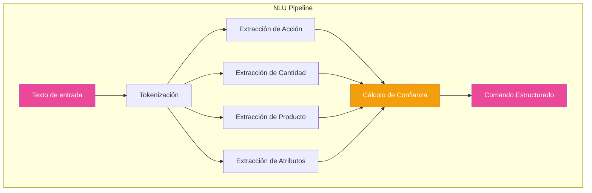

**Técnicas Utilizadas:**
- 📝 Expresiones regulares para patrones
- 🧠 spaCy para análisis morfológico
- 🎯 Clasificación de intenciones
- 📊 Scoring de confianza

**Código:** [nlu_processor.py](file:///c:/Prototipo%20Tesis%201/src/agents/nlu_processor.py)

---

### 4. Gateway de WhatsApp

**Propósito:** Puente entre WhatsApp Business API y el sistema.

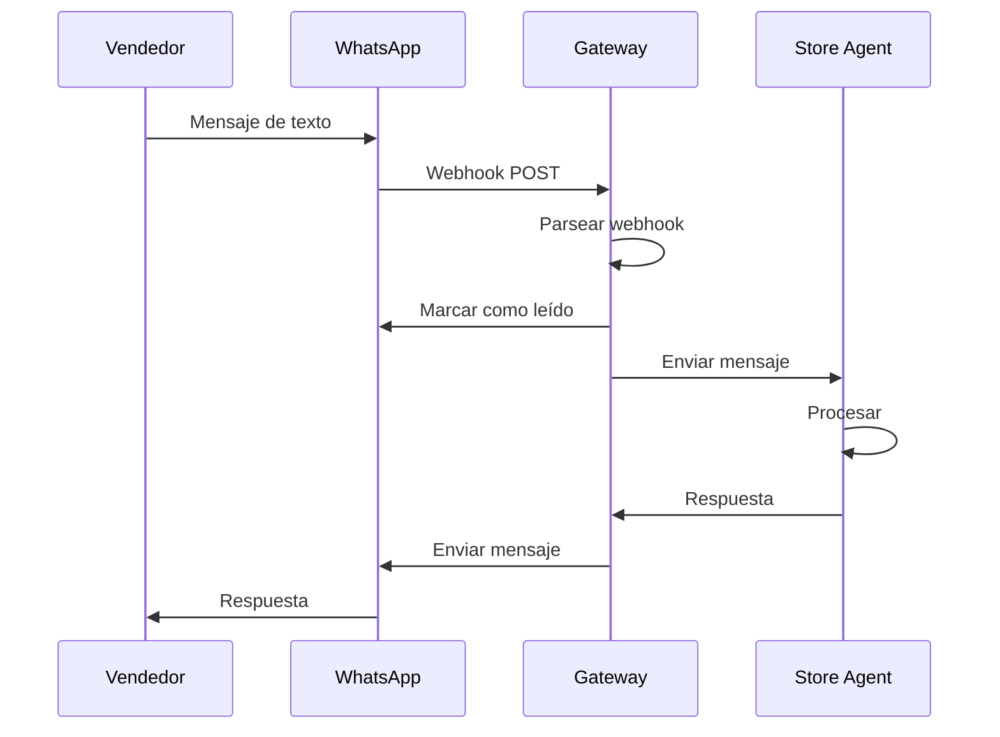

**Funcionalidades:**
- 📨 Recepción de webhooks
- 📤 Envío de mensajes
- ✅ Verificación de webhook
- 📎 Soporte para multimedia

**Código:** [whatsapp_gateway.py](file:///c:/Prototipo%20Tesis%201/src/gateway/whatsapp_gateway.py)

---

## 🔄 Flujo de Datos

### Flujo Completo de una Venta

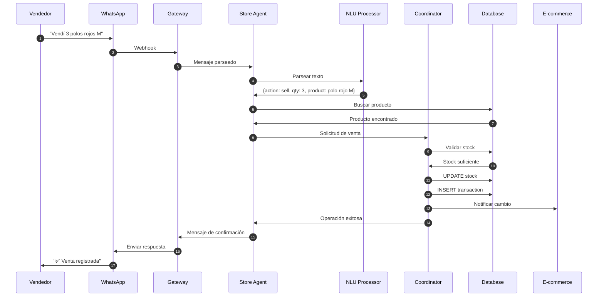

### Estados de una Operación

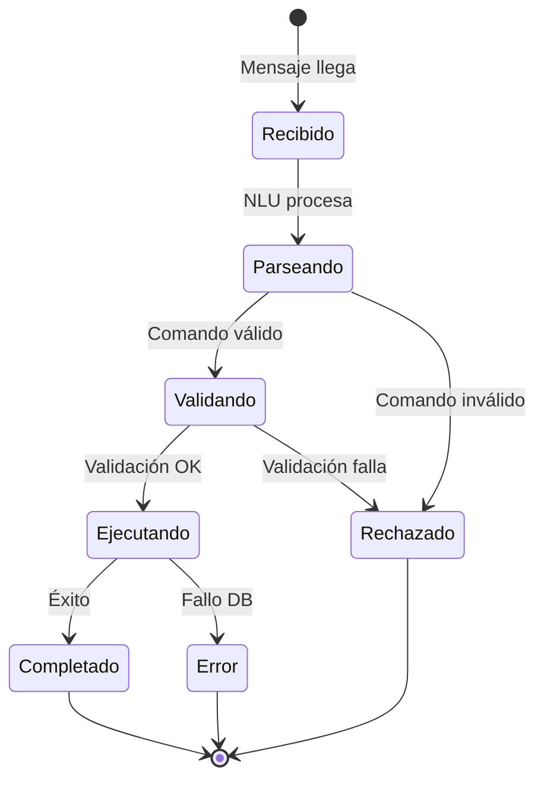

---

## 🎨 Patrones de Diseño

### 1. **Patrón Agente (Agent Pattern)**

Cada agente es autónomo y encapsula su lógica:

```python
class BaseAgent(ABC):
    @abstractmethod
    async def process_message(self, message: Dict) -> Dict:
        pass
```

### 2. **Patrón Strategy (NLU)**

Diferentes estrategias de parsing:

```python
# Regex patterns
# spaCy analysis
# Confidence scoring
```

### 3. **Patrón Repository (Database)**

Abstracción de acceso a datos:

```python
with get_db() as db:
    product = db.query(Product).filter(...).first()
```

### 4. **Patrón Gateway (WhatsApp)**

Encapsulación de API externa:

```python
class WhatsAppGateway:
    def send_message(self, to, message):
        # Abstrae la complejidad de la API
```

### 5. **Patrón Observer (Logging)**

Sistema de logging centralizado:

```python
self.log_activity("action", metadata)
```

---

## 📊 Modelo de Datos

### Diagrama Entidad-Relación

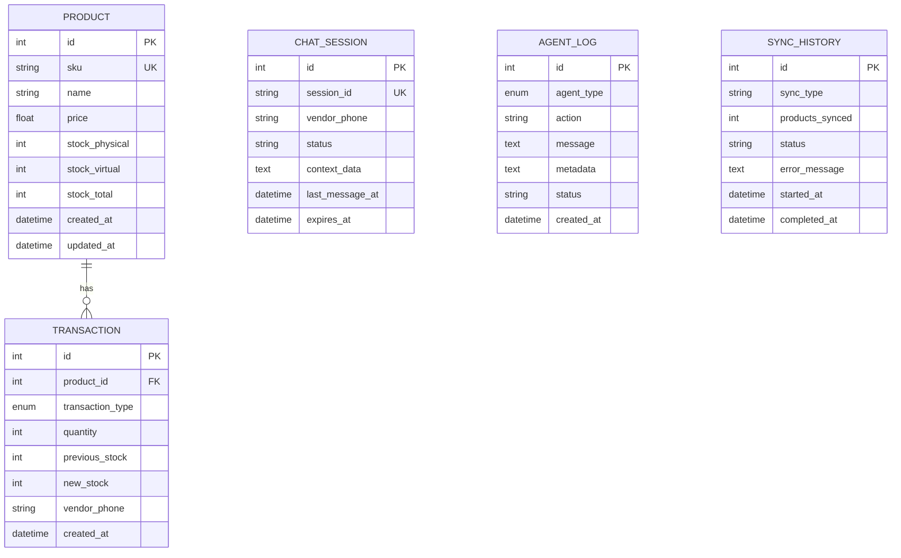

### Relaciones Clave

- **Product → Transaction**: Un producto puede tener múltiples transacciones (1:N)
- **ChatSession**: Independiente, gestiona conversaciones
- **AgentLog**: Registro de actividad de agentes
- **SyncHistory**: Historial de sincronizaciones

---

## 🔐 Seguridad y Validación

### Capas de Validación

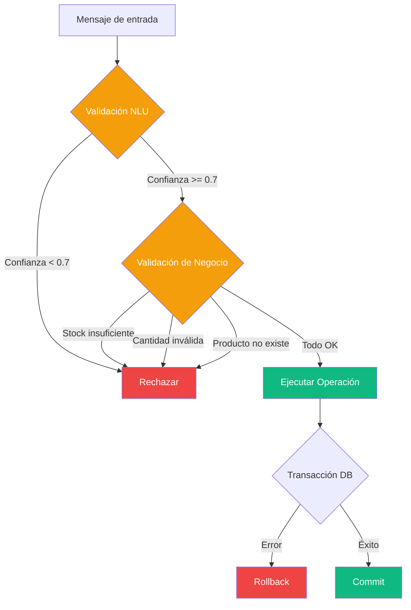

### Validaciones Implementadas

1. **Validación de Entrada (NLU)**
   - Confianza mínima: 0.7
   - Comando reconocido
   - Parámetros presentes

2. **Validación de Negocio (Coordinator)**
   - Stock suficiente para ventas
   - Cantidades positivas
   - Producto existe
   - Operación permitida

3. **Validación de Datos (Database)**
   - Constraints de SQL
   - Tipos de datos
   - Relaciones integridad referencial

---

## 🚀 Escalabilidad

### Estrategias de Escalamiento

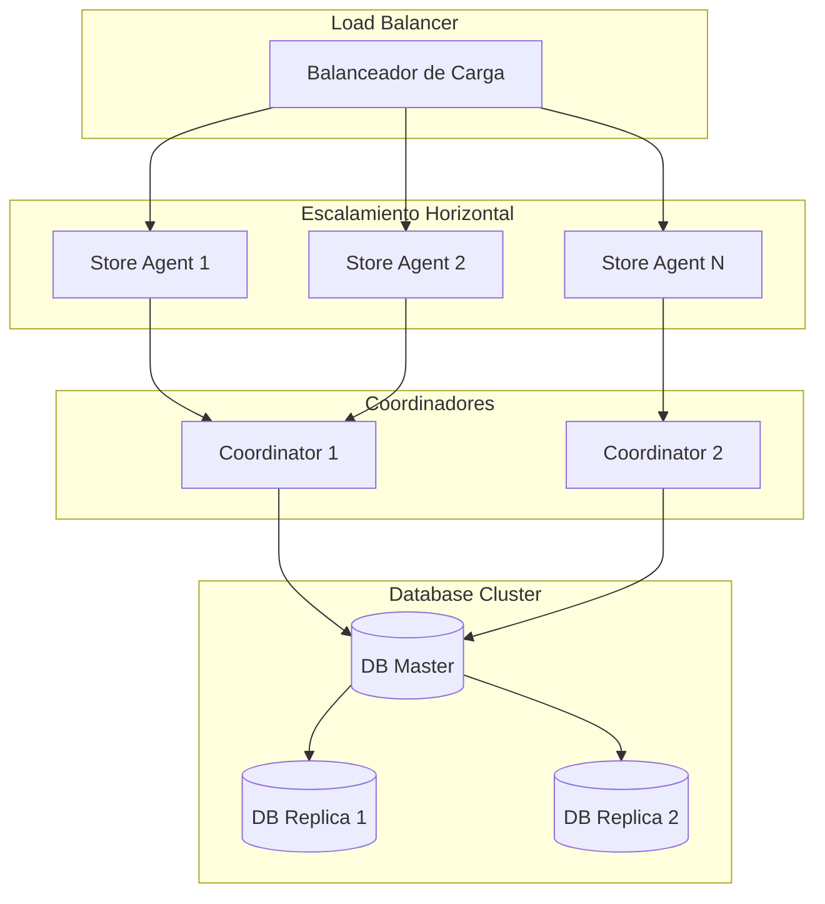

### Puntos de Escalamiento

1. **Agentes**: Múltiples instancias por tipo
2. **API**: Load balancing con Nginx
3. **Database**: Replicación master-slave
4. **Cache**: Redis cluster para sesiones

---

## 📈 Monitoreo y Observabilidad

### Métricas Clave

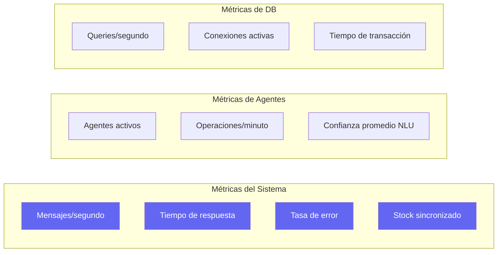

### Sistema de Logging

- **Nivel INFO**: Operaciones normales
- **Nivel WARNING**: Situaciones anómalas
- **Nivel ERROR**: Fallos recuperables
- **Nivel CRITICAL**: Fallos del sistema

---

## 🎯 Casos de Uso Principales

### CU-01: Sincronizar Stock vía Chat

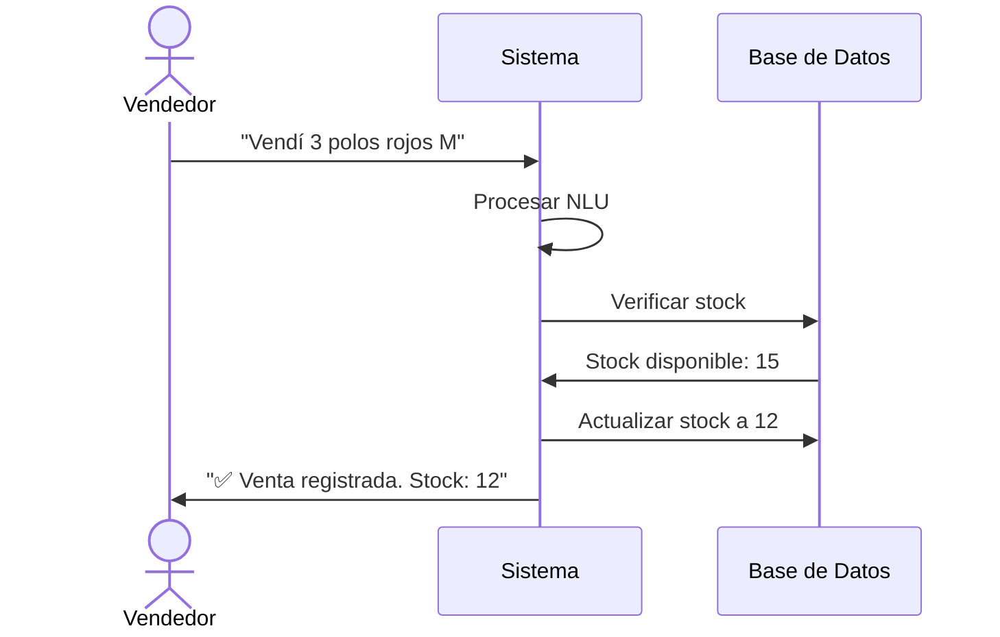

### CU-02: Consultar Inventario

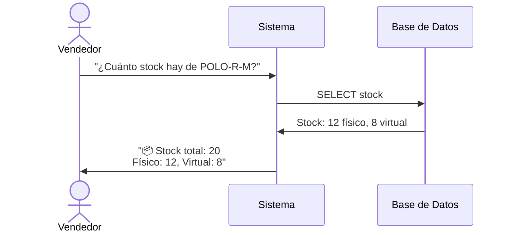

---

## 🔧 Tecnologías y Justificación

| Tecnología | Justificación |
|------------|---------------|
| **Python** | Excelente para IA/NLP, gran ecosistema |
| **FastAPI** | Alto rendimiento, documentación automática |
| **SQLAlchemy** | ORM robusto, soporte multi-DB |
| **SQL Server** | Requerimiento del usuario, enterprise-grade |
| **spaCy** | Líder en NLP, modelos en español |
| **WhatsApp API** | Canal preferido de vendedores |

---

## 📝 Conclusiones Arquitectónicas

### Fortalezas

✅ **Modularidad**: Componentes independientes y reutilizables  
✅ **Escalabilidad**: Diseño horizontal y vertical  
✅ **Mantenibilidad**: Código limpio y documentado  
✅ **Extensibilidad**: Fácil agregar nuevos agentes  
✅ **Robustez**: Validación en múltiples capas  

### Áreas de Mejora Futuras

🔄 **Caché distribuido**: Implementar Redis cluster  
🔄 **Message Queue**: Agregar RabbitMQ/Kafka  
🔄 **Microservicios**: Separar en contenedores Docker  
🔄 **CI/CD**: Pipeline automatizado  
🔄 **Autenticación**: JWT para API  

---

**Documento preparado para revisión de asesor de tesis**  
**Sistema MAS-CIS v1.0 - 2025**
