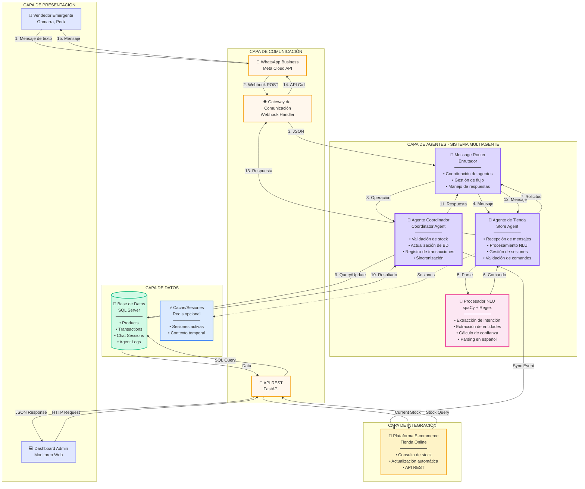
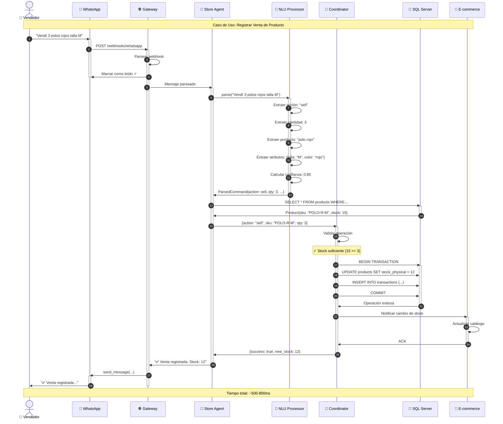
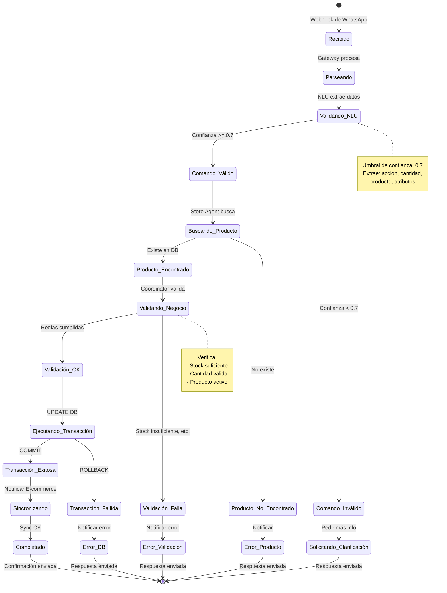
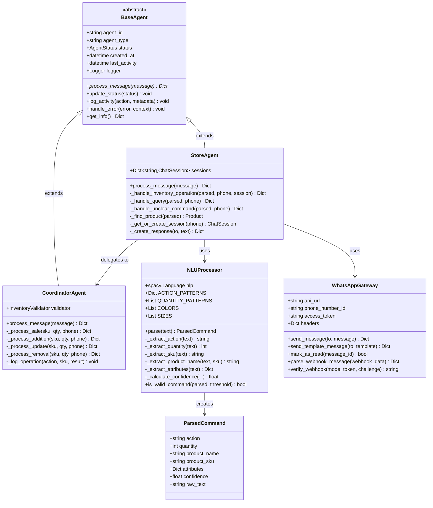
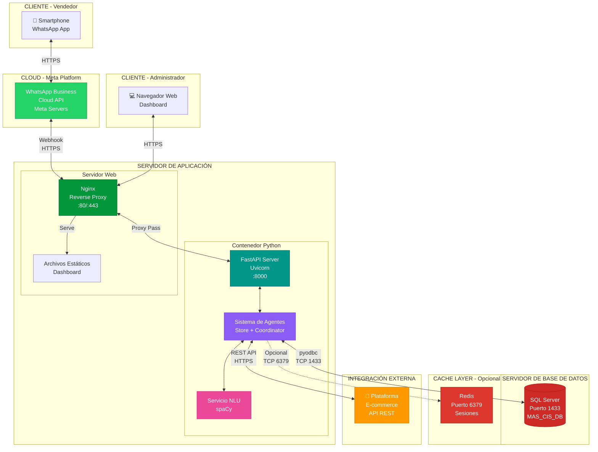
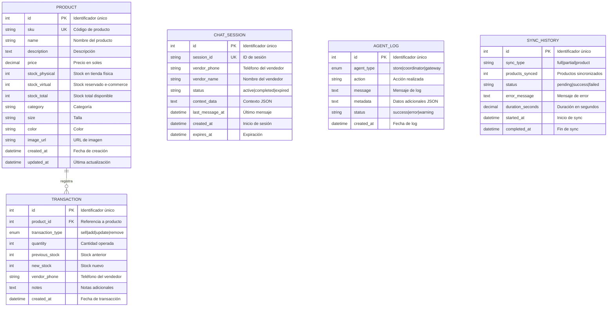
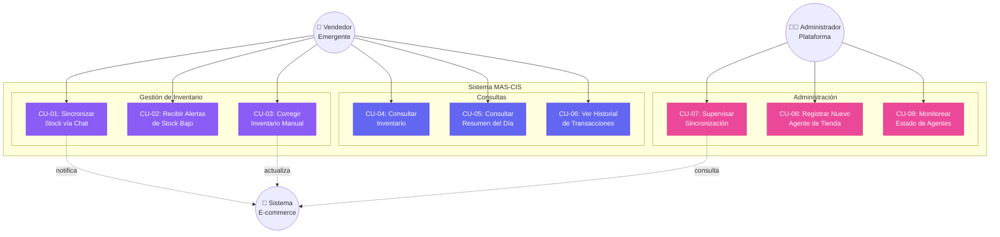

# 📊 Diagramas de Diseño - Sistema MAS-CIS

## Documentación Visual para Revisión de Asesor de Tesis

---

## 1. Diagrama de Arquitectura General

### Descripción

Este diagrama muestra la arquitectura completa del Sistema MAS-CIS con sus tres capas principales:

**Capa de Usuario:**
- Vendedor emergente interactuando vía WhatsApp

**Capa de Agentes (MAS):**
- Gateway de Comunicación (WhatsApp Business API)
- Agente de Tienda con procesamiento NLU
- Agente Coordinador para sincronización

**Capa de Datos:**
- Base de datos SQL Server
- Integración con plataforma de E-commerce

---

## 2. Diagrama de Componentes Detallado

### Leyenda de Componentes

| Símbolo | Componente | Descripción |
|---------|-----------|-------------|
| 👤 | Vendedor | Usuario final del sistema |
| 📱 | WhatsApp | Canal de comunicación |
| 🌐 | Gateway | Punto de entrada de mensajes |
| 🏪 | Store Agent | Agente de interfaz con usuario |
| 🧠 | NLU | Procesamiento de lenguaje natural |
| 🔄 | Coordinator | Agente de sincronización |
| 💾 | Database | Almacenamiento persistente |
| 🛒 | E-commerce | Plataforma de venta online |

---

## 3. Diagrama de Secuencia - Flujo de Venta

---

## 4. Diagrama de Estados - Procesamiento de Mensaje

---

## 5. Diagrama de Clases - Agentes

---

## 6. Diagrama de Despliegue

### Especificaciones de Despliegue

| Componente | Tecnología | Puerto | Recursos Mínimos |
|------------|-----------|--------|------------------|
| **FastAPI** | Python 3.10+ | 8000 | 2 CPU, 4GB RAM |
| **SQL Server** | SQL Server 2019+ | 1433 | 4 CPU, 8GB RAM |
| **Nginx** | Nginx 1.20+ | 80, 443 | 1 CPU, 1GB RAM |
| **Redis** | Redis 7.0+ | 6379 | 1 CPU, 2GB RAM |

---

## 7. Diagrama de Modelo de Datos

---

## 8. Diagrama de Casos de Uso

---

## Resumen para Asesor de Tesis

### Características Arquitectónicas Clave

✅ **Arquitectura Multiagente (MAS)**
- Agentes autónomos con responsabilidades específicas
- Comunicación asíncrona entre agentes
- Coordinación centralizada para consistencia

✅ **Procesamiento de Lenguaje Natural**
- Extracción de intenciones y entidades
- Soporte para español coloquial
- Sistema de confianza para validación

✅ **Sincronización en Tiempo Real**
- Actualización inmediata de inventario
- Notificación a plataforma e-commerce
- Prevención de "inventario falso"

✅ **Escalabilidad y Mantenibilidad**
- Arquitectura modular y extensible
- Separación clara de capas
- Código documentado y testeado

---

**Preparado para:** Revisión de Asesor de Tesis  
**Sistema:** MAS-CIS v1.0  
**Fecha:** 2025  
**Autor:** Prototipo de Tesis Universitaria
