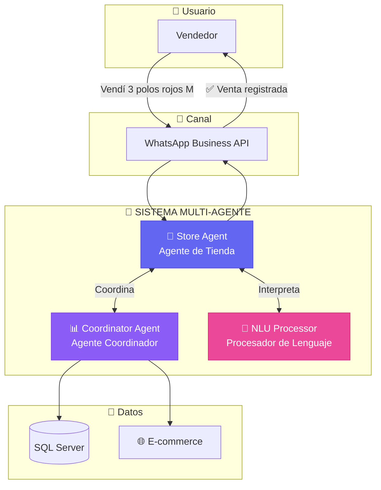
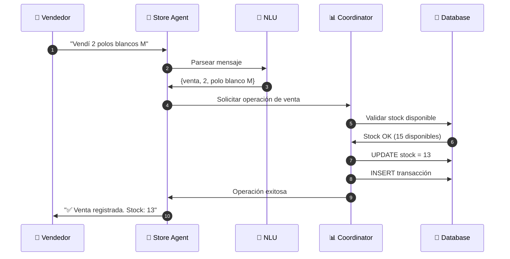

# 🤖 Sistema Multi-Agente para Sincronización de Inventario (MAS-CIS)

## Resumen Ejecutivo

**MAS-CIS** es un prototipo que resuelve el problema de sincronización de inventario entre ventas físicas y e-commerce utilizando **Sistemas Multi-Agente (MAS)** como innovación principal.

### El Problema
Los vendedores emergentes que venden en ferias físicas Y en tiendas online enfrentan:
- ❌ Desincronización de stock entre canales
- ❌ Sobreventa por falta de actualización en tiempo real
- ❌ Pérdida de ventas por información incorrecta

### La Solución
Un sistema inteligente donde **agentes autónomos colaboran** para mantener el inventario sincronizado en tiempo real mediante WhatsApp.

---

## 🎯 Innovación Principal: Sistema Multi-Agente

### ¿Por qué Multi-Agente?

El paradigma MAS fue elegido porque permite:

| Característica | Beneficio |
|---------------|-----------|
| **Autonomía** | Cada agente toma decisiones sin intervención central |
| **Especialización** | Cada agente domina una tarea específica |
| **Colaboración** | Los agentes trabajan juntos hacia un objetivo común |
| **Escalabilidad** | Se pueden agregar nuevos agentes sin modificar los existentes |

---

## 🏗️ Arquitectura de Agentes



---

## 🤖 Los Agentes del Sistema

### 1. Store Agent (Agente de Tienda)

**Rol:** Interfaz inteligente entre el vendedor y el sistema.

| Responsabilidad | Descripción |
|-----------------|-------------|
| Recepción | Recibe mensajes de WhatsApp |
| Interpretación | Usa NLU para entender comandos naturales |
| Búsqueda | Encuentra productos en la base de datos |
| Respuesta | Envía confirmaciones al vendedor |

**Ejemplo de interacción:**
```
Vendedor: "Vendí 2 camisas azules talla L"
Store Agent: Interpreta → Busca producto → Solicita a Coordinator → Responde
```

---

### 2. Coordinator Agent (Agente Coordinador)

**Rol:** Orquestador de operaciones y guardián de la consistencia.

| Responsabilidad | Descripción |
|-----------------|-------------|
| Validación | Verifica reglas de negocio (stock suficiente, etc.) |
| Actualización | Modifica stock de forma atómica |
| Registro | Guarda transacciones para auditoría |
| Sincronización | Notifica cambios al e-commerce |

**Garantías:**
- ✅ No permite stock negativo
- ✅ Registra cada operación
- ✅ Mantiene consistencia entre canales

---

### 3. NLU Processor (Procesador de Lenguaje Natural)

**Rol:** Traductor entre lenguaje humano y comandos del sistema.

| Entrada | Salida |
|---------|--------|
| "Vendí 3 polos rojos M" | `{acción: venta, cantidad: 3, producto: polo, color: rojo, talla: M}` |
| "¿Cuánto stock hay?" | `{acción: consulta, producto: todos}` |
| "Recibí mercadería" | `{acción: restock, ...}` |

**Tecnología:** spaCy + expresiones regulares + scoring de confianza

---

## 🔄 Flujo de Comunicación entre Agentes



---

## 💡 Características del Sistema Multi-Agente

### Autonomía
Cada agente opera de forma independiente:
- **Store Agent** decide cómo responder al usuario
- **Coordinator** decide si una operación es válida
- **NLU** decide la interpretación más probable

### Colaboración
Los agentes trabajan juntos:
```
Store Agent ←→ NLU: Para entender mensajes
Store Agent ←→ Coordinator: Para ejecutar operaciones
```

### Especialización
Cada agente tiene un dominio específico:
- 🛒 **Store Agent**: Comunicación con usuarios
- 📊 **Coordinator**: Lógica de negocio e inventario
- 🧠 **NLU**: Procesamiento de lenguaje

---

## 📊 Comparativa: Sistema Tradicional vs MAS

| Aspecto | Sistema Tradicional | Sistema MAS |
|---------|---------------------|-------------|
| Arquitectura | Monolítica | Distribuida por agentes |
| Mantenimiento | Cambiar un módulo afecta todo | Agentes independientes |
| Escalabilidad | Limitada | Agregar más agentes |
| Inteligencia | Reglas fijas | Agentes con capacidad de decisión |
| Extensibilidad | Compleja | Nuevo agente = nueva capacidad |

---

## 🛠️ Stack Tecnológico

| Componente | Tecnología | Justificación |
|------------|------------|---------------|
| Backend | Python 3.11 + FastAPI | Ideal para IA y APIs |
| NLU | spaCy (español) | Líder en NLP |
| Base de Datos | SQL Server + SQLAlchemy | Robustez empresarial |
| Canal | WhatsApp Business API | Familiar para vendedores |
| E-commerce | HTML/CSS/JS | Tienda demo |

---

## 📈 Resultados Esperados

1. **Sincronización en tiempo real** entre ventas físicas y online
2. **Interfaz natural** vía WhatsApp (sin apps adicionales)
3. **Reducción de sobreventa** por stock desactualizado
4. **Trazabilidad completa** de operaciones

---

## 🎓 Conclusión para Tesis

El sistema MAS-CIS demuestra que la arquitectura de **Sistemas Multi-Agente** es una solución efectiva para:

- ✅ Problemas que requieren **especialización de tareas**
- ✅ Sistemas que necesitan **escalabilidad modular**
- ✅ Aplicaciones con **múltiples fuentes de entrada**
- ✅ Escenarios donde la **autonomía y colaboración** mejoran el resultado

**La innovación principal** no es solo resolver el problema de inventario, sino demostrar cómo el paradigma MAS permite construir sistemas más **flexibles, mantenibles y escalables**.

---

*Documento preparado para presentación de tesis*  
*Sistema MAS-CIS v1.0 - Diciembre 2025*
