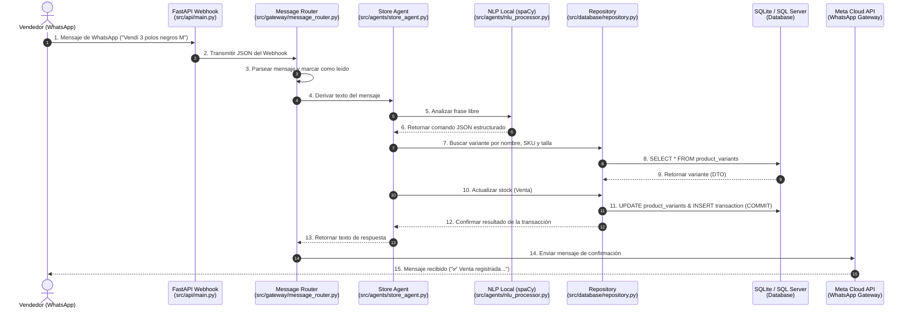

# 🔄 Flujo de Conexión: de WhatsApp a la Base de Datos

Este documento detalla el camino completo que sigue un mensaje enviado por un vendedor en WhatsApp hasta convertirse en una transacción e impacto en el stock dentro de la base de datos del **Sistema MAS-CIS**.

---

## 🗺️ Mapa de Flujo General

A continuación se muestra cómo se transmite la información entre las distintas capas del proyecto:



---

## 🛠️ Explicación Técnica Detallada de cada Paso

### 1. Recepción en el Servidor (FastAPI)
Cuando el vendedor presiona "Enviar", Meta despacha una petición HTTP POST a tu Webhook.
* **Código Relacionado**: [src/api/main.py](file:///c:/Prototipo%20Tesis%201/src/api/main.py#L362-L378)
* **Acción**: El endpoint `/webhooks/whatsapp` (o su alias `/api/whatsapp/webhook`) recibe la carga JSON y llama al router de mensajería:
  ```python
  await message_router.route_whatsapp_message(webhook_data)
  ```

### 2. Extracción y Enrutamiento (Message Router)
* **Código Relacionado**: [src/gateway/message_router.py](file:///c:/Prototipo%20Tesis%201/src/gateway/message_router.py#L23-L49) y [src/gateway/whatsapp_gateway.py](file:///c:/Prototipo%20Tesis%201/src/gateway/whatsapp_gateway.py#L167)
* **Acción**:
  - `whatsapp_gateway` extrae el número del remitente (`from`), el nombre (`contact_name`) y el texto del mensaje (`text`).
  - Llama a `whatsapp_gateway.mark_as_read(message_id)` para confirmar a Meta que el mensaje fue recibido.
  - Envía la estructura limpia al **Store Agent**:
    ```python
    response = await self.store_agent.process_message(parsed_message)
    ```

### 3. Comprensión del Lenguaje Natural (NLU)
* **Código Relacionado**: [src/agents/store_agent.py](file:///c:/Prototipo%20Tesis%201/src/agents/store_agent.py) y [src/agents/nlu_processor.py](file:///c:/Prototipo%20Tesis%201/src/agents/nlu_processor.py)
* **Pasos Lógicos**:
  - El agente de tienda invoca al procesador NLU: `parsed = nlu_processor.parse(text)`.
  - El procesador utiliza **spaCy** y reglas de Expresiones Regulares (Regex) enviando el texto del vendedor a través de patrones de intención (`sell`, `add`, `query`, etc.) y atributos (producto, talla, cantidad, color).
  - El motor NLP retorna un JSON limpio que indica el comando interpretado (ej: `{"action": "sell", "product_sku": "POLO-NEGRO", "quantity": 3, "size": "M"}`).

### 4. Consulta a la Base de Datos (Lectura)
* **Código Relacionado**: [src/database/repository.py](file:///c:/Prototipo%20Tesis%201/src/database/repository.py#L20-L78)
* **Acción**:
  - En la función `_handle_sell` del agente, se busca la variante que corresponda a las entidades extraídas llamando a `product_repository.find_variant(...)`.
  - El repositorio utiliza la función `get_db()` de [connection.py](file:///c:/Prototipo%20Tesis%201/src/database/connection.py#L53) para iniciar una conexión ORM con la base de datos (SQLite en desarrollo local).
  - Se ejecuta un query SQL para verificar si existe el producto `POLO-NEGRO` con la talla `M`.
  - Devuelve un DTO (`VariantDTO`) que es una estructura de datos ligera e independiente de la sesión de base de datos, evitando problemas de concurrencia y conexiones colgadas.

### 5. Modificación e Inserción de la Transacción (Escritura)
* **Código Relacionado**: [src/database/repository.py](file:///c:/Prototipo%20Tesis%201/src/database/repository.py#L80-L160)
* **Acción**:
  - Tras verificar la validez de la operación, el agente llama a `product_repository.update_stock(variant_id, quantity, operation="sell")`.
  - El repositorio inicia una sesión transaccional:
    ```python
    with get_db() as db:
        # 1. Recupera la entidad mapeada ProductVariant
        variant = db.query(ProductVariant).filter(...).first()
        
        # 2. Modifica los campos en memoria
        variant.stock_total -= abs(quantity_change)
        variant.stock_physical -= abs(quantity_change)
        
        # 3. Registra la transacción histórica en la tabla 'transactions'
        # (El context manager 'get_db' ejecuta automáticamente db.commit() al salir del bloque)
    ```
  - Esto impacta la persistencia física en el disco (`mas_cis.db` o base de datos centralizada SQL Server).

### 6. Respuesta por WhatsApp
* **Código Relacionado**: [src/gateway/whatsapp_gateway.py](file:///c:/Prototipo%20Tesis%201/src/gateway/whatsapp_gateway.py#L27-L76)
* **Acción**:
  - El **Store Agent** genera una respuesta formateada confirmando el éxito o informando de un error (ej. *"⚠️ Stock insuficiente. Disponible: 2"*).
  - La respuesta se devuelve al router, el cual ejecuta:
    ```python
    whatsapp_gateway.send_message(to=response.get("to"), message=response.get("text"))
    ```
  - Se despacha una solicitud POST HTTPS a Meta Cloud API y el vendedor visualiza la confirmación en su teléfono móvil.
