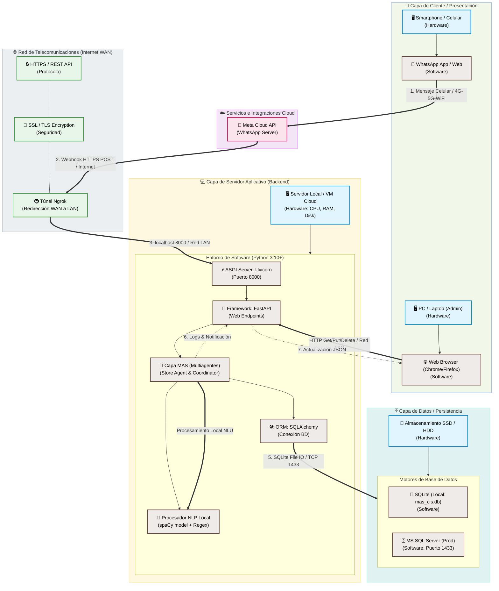

# 🗺️ Modelo Técnico de Arquitectura: Hardware, Software y Telecomunicaciones

Este documento presenta el modelo técnico integral del **Sistema MAS-CIS**, detallando la infraestructura física (**Hardware**), las tecnologías aplicadas (**Software**) y los canales de comunicación e interconexión (**Telecomunicaciones**).

---

## 📊 Diagrama Técnico de Arquitectura General

El siguiente diagrama gráfico representa la interacción visual de todo el sistema (incluyendo hardware, software y telecomunicaciones):

### 📊 Diagrama Técnico de Bloques (Código Mermaid)

El siguiente diagrama de bloques representa la interacción entre las diferentes capas físicas y lógicas del sistema:

---

## 🛠️ Detalle de los Tres Pilares Tecnológicos

### 1. Hardware (Infraestructura Física)
Representa los equipos físicos donde reside y se procesa el sistema:

- **Dispositivo del Vendedor**: Teléfonos inteligentes (Smartphones) Android o iOS que ejecutan la interfaz de chat (WhatsApp). No requieren potencia de cómputo especial, ya que el procesamiento es delegado al servidor.
- **Dispositivo de Administración (Cliente Web)**: PC de escritorio, laptop o tablets que ejecutan un navegador web para acceder al Dashboard interactivo.
- **Servidor Aplicativo (Hosting)**: 
  - En desarrollo: PC local (Windows OS).
  - En producción: Una Máquina Virtual (VM) en la nube (AWS EC2, Google Compute Engine, Azure VM) con CPU de arquitectura x86_64, memoria RAM (mínimo 2GB para soportar spaCy) y almacenamiento en disco de estado sólido (SSD).
- **Servidor de Base de Datos**: Servidor local o administrado (ej: Azure SQL Database) para alojar las transacciones e inventario.

---

### 2. Software (Capa Lógica y Aplicativa)
Define los programas, librerías y componentes lógicos del sistema:

- **Capa Cliente (Frontend)**:
  - Navegador web interpretando código nativo: **HTML5 semántico**, **CSS3 vanilla** para diseño visual de la interfaz y **JavaScript (ES6+)** para hacer peticiones asíncronas fetch y manejar la renderización de datos.
  - Aplicación propietaria de WhatsApp (Meta).
- **Capa de Aplicación (Backend - Python 3.10+)**:
  - **Uvicorn**: Servidor web con interfaz ASGI de alta velocidad para Python.
  - **FastAPI**: Framework web encargado del enrutamiento de peticiones API y validación de esquemas (Pydantic).
  - **spaCy & Regex (NLU Local)**: Procesamiento de lenguaje natural local en español sin depender de APIs de pago externas, reduciendo costos.
  - **SQLAlchemy ORM**: Mapeador objeto-relacional para interactuar con la base de datos de manera agnóstica al driver.
- **Base de Datos**:
  - **SQLite**: Motor de base de datos relacional ligero contenido en el archivo local `mas_cis.db`.
  - **Microsoft SQL Server**: Motor corporativo usado mediante el driver **pyodbc**.

---

### 3. Telecomunicaciones (Protocolos de Red e Interconectividad)
Describe los medios físicos de transmisión, las redes y los protocolos de comunicación que permiten a los componentes hablar entre sí:

- **Redes Móviles (4G/5G) y WiFi**: Medios de acceso inalámbrico que enlazan el smartphone del vendedor con la red WAN de internet.
- **Meta Cloud Webhooks (HTTPS / Puerto 443)**: Enlace cifrado SSL/TLS por donde Meta envía las notificaciones en formato JSON cada vez que llega un mensaje al número de WhatsApp Business configurado.
- **Túnel de Redirección (Ngrok / HTTPS)**: Software de tunelización que expone el puerto local `8000` (LAN) a una dirección pública segura `HTTPS` (WAN), permitiendo a los servidores externos de Meta enviar webhooks de forma segura a una máquina local en desarrollo.
- **APIs de Integración Cloud (REST / JSON / HTTPS)**:
  - Comunicación del backend hacia los endpoints de Graph API de Meta para enviar los mensajes de confirmación de vuelta al chat del vendedor.
- **Protocolo de Red Local (Localhost Loopback)**: Comunicación por socket TCP interna en el servidor para unir el Servidor Uvicorn (`127.0.0.1:8000`) con el navegador del Administrador o el motor SQL local.
- **Conectividad de Base de Datos**: Puerto `1433` (protocolo TCP/IP corporativo) si se conecta a un servidor remoto de Microsoft SQL Server.
